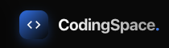

<p align="center">
    <picture>
      
    </picture>
</p>
<p align="center">Just another AI coding agent.</p>

# CodingSpace

> The AI-Powered Path to Mastering Modern Development

CodingSpace is an advanced, interactive learning platform designed to bridge the gap between theoretical knowledge and practical execution. Leveraging the power of LLMs, it provides a personalized, hands-on coding experience that adapts to your pace.

## Why CodingSpace?

Traditional tutorials often leave students in the "tutorial hell" — where they can follow instructions but struggle to build independently. **CodingSpace** solves this by:

- **Active Engagement**: No passive reading. Every concept is reinforced with live code execution.
- **Adaptive Support**: The AI doesn't just give answers; it provides _hints_ and _conceptual explanations_ tailored to your specific mistake.
- **Visual Learning**: See the architecture behind the code with auto-generated diagrams.

---

## Features

- **AI-Integrated Tutoring**: A persistent AI assistant that understands your code and provides contextual guidance without giving away the answers.
- **Full-Featured Interactive Sandbox**: Execute Python, JavaScript, and Rust directly in your browser with a robust, terminal-like feedback loop.
- **Dynamic Knowledge Visualization**: Track your progress and visualize complex architectures using interactive Mermaid diagrams.
- **Structured Learning Paths**: Curated lessons that transition from fundamental syntax to advanced system design.
- **Premium Developer Experience**: A sleek, dark-mode first interface built with Quasar and Vue 3, featuring CodeMirror 6 for a professional editing feel.

---

## Tech Stack

- **Core Framework**: [Quasar Framework](https://quasar.dev/) (Vue 3)
- **State Management**: [Pinia](https://pinia.vuejs.org/)
- **Code Editor**: [CodeMirror 6](https://codemirror.net/)
- **Visuals & Diagrams**: [Mermaid.js](https://mermaid-js.github.io/)
- **Styling**: Vanilla CSS with Quasar Design Tokens
- **Runtime/Package Manager**: [npm](https://www.npmjs.com/)

---

## Installation

1. **Install dependencies**

   ```bash
   npm install
   ```

2. **Launch the development server**
   ```bash
   npm run dev
   ```
